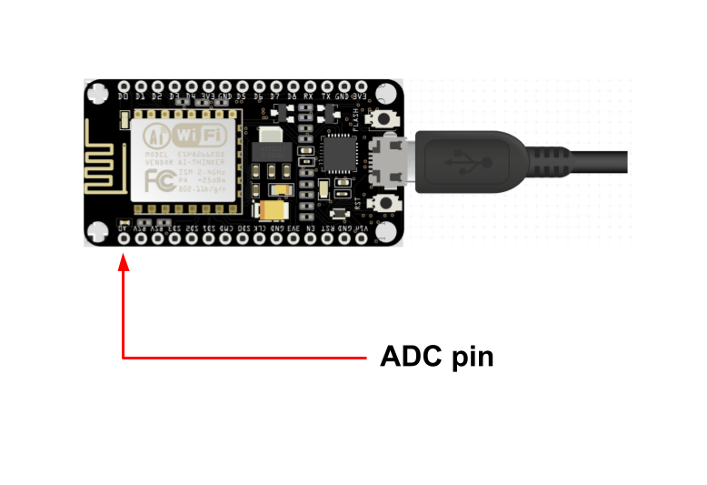
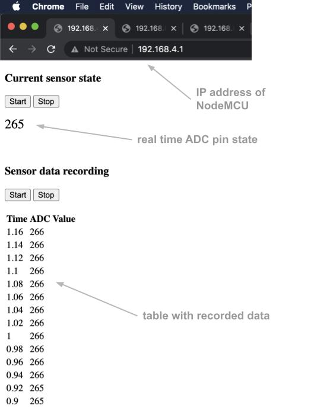

# NodeMCU-ADC-output-web-interface

 

## About

The main purpose of the software is to display the value from the ADC pin in real time on a simple website. We can connect various analog sensors such as: photoresistor, temperature or sound sensor to the NodeMCU. Sometimes we just want to quickly read the value indicated by a specific sensor or save the values in a simple table with timestamps. Therefore, a very simple interface has been created in the form of a raw website that is hosted by a web server on NodeMCU. In addition, to read data from the ADC pin, we do not need to be physically connected to the board. You just need to be within the range of wifi.  
 
## Usage

NodeMCU works in AP mode creating its own open wifi network called "NodeMCU". It is enough to connect the board to a power source and join the "NodeMCU" network from any device (PC, smartphone, tablet). Then enter the NodeMCU IP address - ***192.168.4.1*** in any browser, which will display a simple interface.

The interface has two basic functions:

1) Reading the current state from the ADC pin with automatic refreshing (with 1s interval)

2) Data recording in the form of a simple table with timestamps every 0.02 s   
    

 
Both functions are started by clicking the appropriate START or STOP button. The generated table with data can be easily copied. Just click anywhere in the table area and all values will be selected automatically and they can be transferred to MS Excel or Google Sheet for further analysis.

By default, NodeMCU works in AP mode, but with a little code modification we can change NodeMCU to serve as a client and join any wifi network. Then it makes sense to use the Arduino IDE (Serial Monitor) to check the NodeMCU IP address on the new network.  
 

## Installation

The program was created in Arduino Programming Language. The easiest way is to upload it to the NodeMCU board using the Arduino IDE. Make sure that both files are in the same folder.

The presented web interface is raw and works on a proof of concept basis. There is an HTML template in the "index.h" file, which you can freely modify and adapt to your needs.
